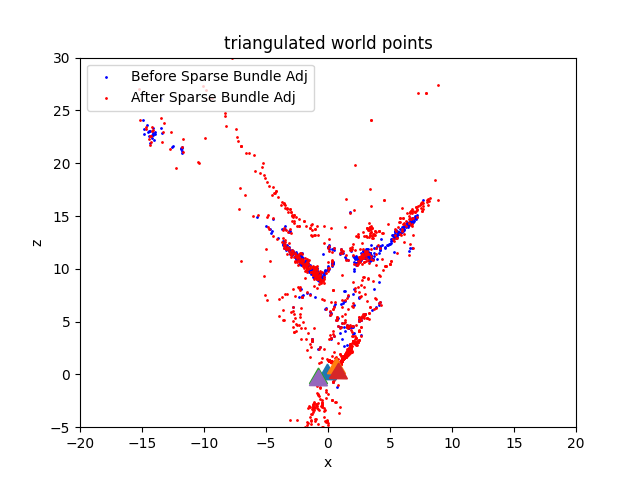
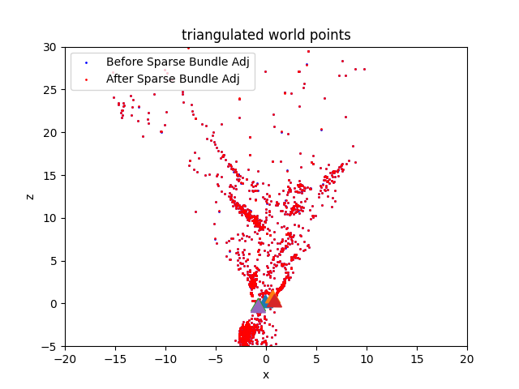

# SfM-Feature-Matching

## Overview

| **SfM Results** |  |
|----------|----------|
|  |  |
| Before and After Bundle Adjustment on Images **[1](Data/1.png)**, **[2](Data/2.png)**, **[3](Data/3.png)**  | Before and After Bundle Adjustment on all 5 Images  |

This project implements a Structure from Motion (SfM) pipeline using classical computer vision techniques such as SIFT for feature matching and RANSAC for outlier rejection. It includes various stages such as camera pose estimation, 3D point triangulation, and bundle adjustment to refine the poses and points.

## Table of Contents

- [Overview](#overview)
- [Requirements](#requirements)
- [Usage](#usage)
- [Pipeline Overview](#pipeline-overview)
- [Results](#results)
- [Acknowledgments](#acknowledgments)

## Requirements

To run this script, you need Python 3 and the following Python packages:
- `Numpy`
- `Opencv-python`
- `Scipy`
- `Matplotlib`
- `Random`

You can install these packages using pip:

```bash
pip install numpy opencv-python scipy matplotlib random
```
## Usage
1. Clone the repository:

```bash
git clone https://github.com/AbhijeetRathi12/SfM-Feature-Matching.git
cd SfM-Feature-Matching-main
```

2. Place your dataset in the `Data` directory. Ensure the dataset includes images and a `calibration.txt` file containing the camera matrix.

3. Run the SfM pipeline:
 ```bash
python Wrapper.py
```

## Pipeline Overview

The main stages of the SfM pipeline are as follows:

1. **Feature Matching**:
    - Extracts and matches features between pairs of images using SIFT.

2. **RANSAC for Outlier Rejection**:
    - Uses RANSAC to find inliers and compute the fundamental matrix between image pairs.

3. **Essential Matrix and Camera Pose Estimation**:
    - Computes the essential matrix from the fundamental matrix and estimates the camera poses.

4. **Triangulation**:
    - Performs linear and non-linear triangulation to reconstruct 3D points.

5. **Bundle Adjustment**:
    - Optimizes the camera poses and 3D points to minimize the reprojection error.

## Results

The pipeline generates various intermediate and final outputs, including:

- Matched features before and after RANSAC.
- Epipolar lines and essential matrix visualization.
- 3D points before and after bundle adjustment.
- Reprojection error visualizations.

Results are saved in the `Data/IntermediateOutputImages` directory.

## Acknowledgments

This project leverages classical computer vision techniques for SfM, inspired by various academic papers and resources on feature matching, triangulation, and bundle adjustment.

